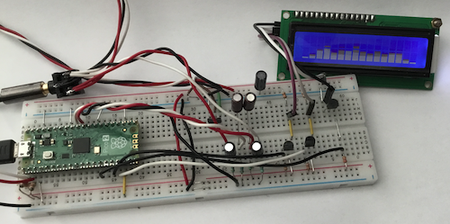
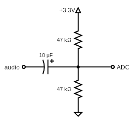

# p2sv

`p2sv` is simple project to use Raspberry Pi pico 2 as an audio spectrum visualizer.

`p2sv` uses [kissfft](https://github.com/mborgerding/kissfft) for as FFT and
some algorithms from [cava](https://github.com/karlstav/cava) to get basic visualization.

Two ADCs are used to digitize stereo audio signals with about 44.1KHz sampling rate.

Test connection on breadboard: 

Audio signals need level shift to positve voltage for input to ADC.

Used this simple circuit to do so:

Youtube demo video with LCD 16 characters 2 lines:

Youtube demo video with OLED 128x64:

## SDK version

This projectd uses Pico SDK 2.1.0.
